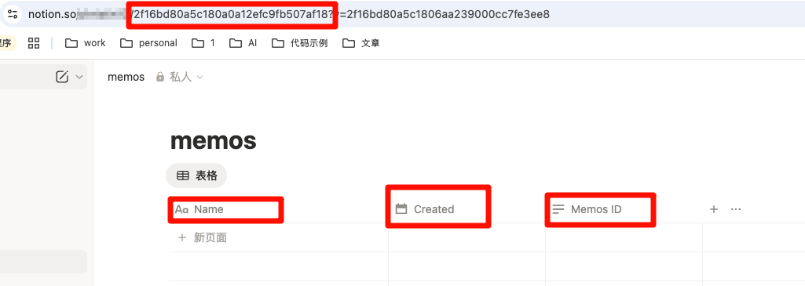

# memos-notion-sync

把 Memos 同步到 Notion。包含：
- Cloudflare Worker webhook（实时处理 memo.created）
- 一次性批量同步脚本（用于历史的 memo）

## 功能
- 解析 memo 内容并按段落拆分
- 同步附件图片与正文中的 Markdown 图片链接
- 写入 Notion 数据库字段：`Name`、`Created`、`Memos ID`
- 创建事件支持延迟拉取附件，减少外链生成延迟导致的缺图

## 依赖
- Node.js（本地开发与批量同步脚本）
- 可访问的 Memos API
- Notion Integration Token 与目标数据库

## Notion 创建应用获取 token
- 访问 https://www.notion.so/profile/integrations/internal 创建新集成，复制 token（NOTION_TOKEN）
- 在 notion 中创建数据库
  请创建以下字段：（字段名必须一致，否则 worker 会报错找不到对应的字段）

  `Name`
  `Created`
  `Memos ID`



- 地址栏中截图的部分就是需要的 NOTION_DATABASE_ID（数据库 ID）
- 给集成添加数据库权限，可以在集成中添加也可以在数据库页面添加

## Memos 配置
> 我用的 Memos 版本是 0.25.3，其他版本可能有不同，请自行查找
- 在设置 - 我的账号 - 访问令牌中 新建一个令牌（MEMOS_API_TOKEN）
- worker 部署之后可以获取到一个地址，把地址填入 设置 - 偏好设置 - Webhooks 中，地址应该类似（xxx.xxx.workers.dev）

## Worker（Webhook）配置
在 Worker 里配置环境变量：
- `NOTION_TOKEN`
- `NOTION_DATABASE_ID`
- `MEMOS_API_BASE`（如 `https://your-memos.com/api/v1`）
- `MEMOS_API_TOKEN`
> 可以在本地使用 wrangler push NOTION_TOKEN 等命令添加私密环境变量，也可以手动在后台配置

本地开发：
```bash
npm run dev
```

部署：
```bash
npm run deploy
```

## 批量同步（一次性脚本）
脚本路径：`scripts/bulk-sync.mjs`。分页拉取 memos，并将 memo 写入 Notion。

运行：
```bash
node scripts/bulk-sync.mjs
```

可选环境变量：
- `MEMOS_PAGE_SIZE`（默认 10）
- `NOTION_DELAY_MS`（默认 200）
- `NOTION_UPDATE_EXISTING`（设为 `true` 时更新已存在页面）

## 说明
- webhook 创建事件会延迟 10 秒后再拉附件，避免外链生成延迟导致的缺图。
- 如果为了快速测试在脚本中写死 token，请避免提交到 GitHub。

## 参考资料
- [Memos API](https://usememos.com/docs/api)
- [Notion API](https://developers.notion.com/reference/intro)
